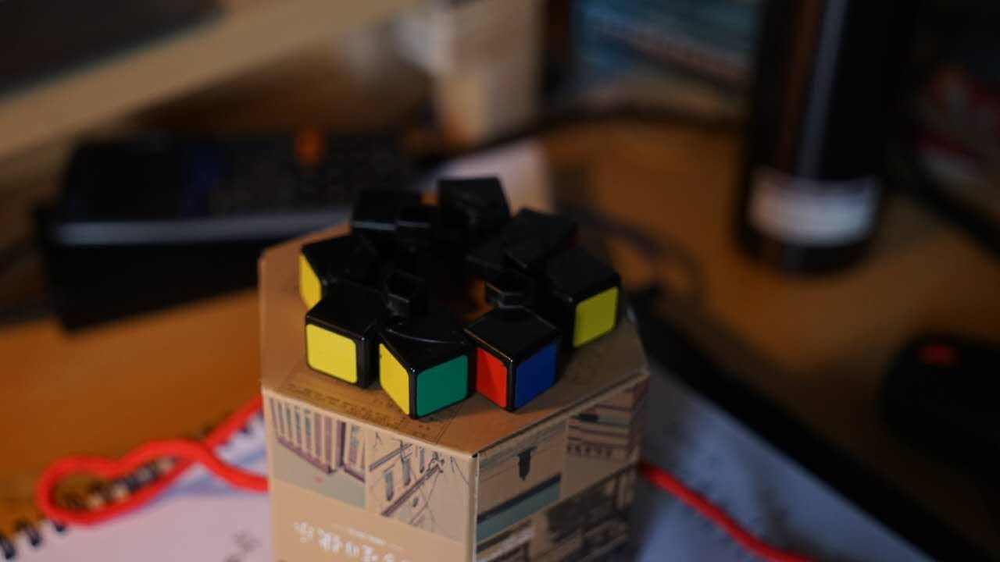
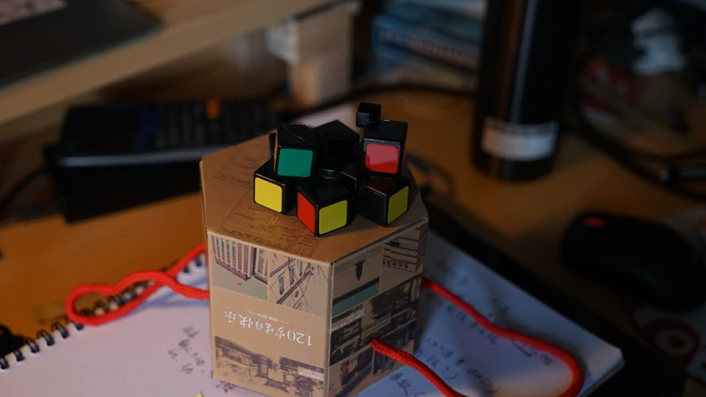

# 大作业迭代报告

报告人：

- 朱超捷 5130379013 （组长）

- 舒步清 5130379018

## 游戏名
- EN：The Journey of Babel

- CN：通天

## 问题陈述

> 如何为正在打拼的年轻人做一个的寓意人生的竞争合作类游戏？

## 头脑风暴

### 四要素

- 剧情

概述：远古的时代中，人类从一阵巨响和晃动中惊醒，大地崩裂，阴云笼罩，亡魂四起。悲嚎之声，杀戮之影，这片原本祥和的凯尔帕提姆(Chaopatum)大陆犹如陷入地狱一般。而似乎，上帝并没有把他们逼上绝路，在大陆的中央，一座通天之塔拔地而起。它光芒万丈，它直冲云霄。“My God”，绝望中的曙光，这一定是人类最后的希望了。成群的人，在亡魂的追赶下，如蝗虫般蜂拥而至。塔下的他们仰视望这通天之路，贪婪之眼，清澈之眸，哪一个是属于你的呢？

理由：竞争与合作可以直接反应地狱和天堂的之间的区别，如地狱都是竞争，天堂的是合作，这能很好反应我们的主题；对于人生，我们把整个人生分成三个阶段，他可以相应地映射到人生的跨度上，在游戏中将以云层来分阶段：第一阶段为底层修炼（教程），多合作少竞争，寓意在孩提时在象牙塔中学习的纯粹的日子；第二阶段为激烈竞争阶段，狗咬狗，人踩人，合作减少竞争增加，寓意人生仕途朋友越来越少，周围人们越来越冷漠残酷的阶段；第三阶段为拨云见日，竞争和合作都不复存在，地图机关会变得异常多，需要谨慎思考，破解最终谜题，登上塔顶，寓意人生终点领悟真理。

- 机制

这是一个玩家攀爬方块来前进的游戏。

操作方式：方向键控制移动，有固定按键抽出身边方块或者往下扔来阻碍他人，攀爬键实现攀爬效果

机关：有些方块有特殊效果，如喷火、辅助跳跃、机关、当做投掷物等，这些部分可以在玩家跳跃上去之后触发，另外部分可以通过玩家控制投掷。

竞争的体现：角色可以自己选定攀爬路线，达到竞速的效果；或者投掷方块，干扰他人前进。

合作的体现：会有一些角色可以和主角产生增益的buff，如在一起时可以增加移动速度。

人生的体现：必须要要不断往上爬，必须进步，止步不前就会被底部的亡魂追上； 有些时候一直冲动前进，如果一段时间玩家没有操作，那么整个游戏时间流动速度就会变慢，可以供玩家驻足思考接下来的路线。NPC角色的正负可以靠身上的光芒种类来体现。

用高度体现分数和成就，与击杀无关。

视角：第三人称追随视角

- 美术

采用非真实感渲染。把整个画面渲染得整个阴森，昏暗，体现地狱阴森的感觉。

在合作的时候合作者之间会有一条亮光表示羁绊，而竞争者则会散发阴暗的气息。

机关特效会做的比较血腥，具有视觉冲击力。

塔会被乌云、烟气、粒子效果环绕。

整体就是玩家在压抑的环境中寻找光明的感觉。

- 技术

所有NPC都会采用A* FSM算法寻找向上的道路

无论是机关，还是雾气都会有大量的粒子效果

它周围的亡魂会用群体动画实现

用Shader实现非真实性渲染

玩家用手柄玩的时候会增加震动的反馈

###创意候选清单

- 写实画风

想借鉴战神，血腥，但是与整体我们游戏不是特别相关，就没有采用

- 前进方式是纯攀爬，没有站立

纯爬动，需要构建的把方块当做节点的数据结构和实现复杂多样的攀爬动画效果，这需要大量的时间成本。

- 方块能获得道具

加大游戏复杂性，道具功能数据的平衡需要大量实践。也不一定能增强游戏体验。

- 纯竞速

不能体现人生三阶段和竞争。

- 塔防

塔上可以搭建根据地，防御下面的亡魂，不符合剧情，人类没这么强，有搭的时间早被吞了，游戏也不是很有创新性，也不能体现人生。

- 飞行的移动模式

影响ai算法和整个游戏的节奏。

- 一击必杀的玩家死亡机制

降低游戏难度，考虑到针对人群是生活中有压力的人，不希望他们在游戏中也被打压。

- 靠击杀也能得分

这是一个映射人生的游戏，我们不希望玩家沉静在伤害中。成就应当只和高度有关。

##风险评估

1. A*FSM算法如何写的让玩家不能利用其中规律  低

2. 方块建模实现真实性的话会有时间成本   高

3. 音效 不能很好的融入场景或者是音效资源难找。  低

4. 角色的动作建模和动画效果可能不能达到理想程度  中

5. 场景渲染 可能不好或者耗费性能  中

6. 群体动画的学习成本 高

7. 玩家游戏趣味性难以保证  中

8. 场景生成算法 低

##解决

1. 给AI决策增加一定的随机性

2. 方块碰撞，每个方块都有自己的物理碰撞，为了流畅性，用立方体表示碰撞体积，但是通过uv贴图体现不同的纹理

3. 寻找专业人才的帮助 

4. 精简模型，网上下载

5. 离线渲染，cg播放替代动态渲染 

6. 尽早开始学习群体动画相关内容

7. 做好市场调查，迎合受众，多次迭代修改。利用纸上原型进行初步设计和试玩，如场景生成和方块抽出效果预览。以下是对场景生成的纸面原型预览，上方一张图是环装均匀排布，下面一张图是随机排布，考虑增加趣味性和意外性，我们决定采用下方这种随机排布算法。

8. 从简单重复的开始做起，不断迭代增加复杂性

##迭代过程

上述内容是我们最终迭代（迭代三）的结果，下面我们陈述我们前两次迭代的过程：

###迭代一

- 问题陈述 

  如何为正在打拼的年轻人做一个的寓意人生的竞争合作类游戏？（整个迭代过程相同）

- 解决方案 

  - 综述 ：第一人称视角，玩家使用方块搭建陈堡的塔防游戏。

  - 胜利条件：仿照war3PRG地图《我与僵尸有个约会》和《兽人必须死》，依靠共同打造城墙、陷阱来体现合作关系，也可以自己单独搭建陈堡，存活下来并且活到最后的人就是胜利，这就能体现竞争。

  - 玩法：不同方块能出发不同效果，玩家可以自己个性化搭建自己的陈堡来守护。僵尸可以破坏城堡。

- 风险

 1. 陈堡搭建的物理引擎不能用真实的物理引擎，真实的物理引擎会加大用户的建筑能力要求

 2. 外部敌人的攻击oi策略难以制定和实现，不仅仅是行走路线，还有破坏的选择，都要做到不能让用户抓到规律。

 3. 音效资源难寻

 4. 寓意难以映射到人生，难以联想到人生，就是简简单单的造房子的塔防游戏。

 5. 单人游戏难以体验游戏合作。

 6. 要实现群体动画就会有大量敌人，这会增加游戏的难度

- 原型

 - 视角模式模拟： 自己一边玩游戏，一边吃东西（体验用户一边搭建房屋，一边防守）。

 - 玩法模拟： 在minecraft内，手动搭建房屋，计算时间，但是三维世界的，在一个外界有压迫的情况下，搭建房屋。

 - ai模拟：假象自己是一个入侵者，对于已经建好的方块城堡，考虑如何进攻。

- 结果

 - 视角： 第一人称视角切换很频繁，两边相互干扰，效率都不高，可能会让玩家疲惫。视角需要切换成斜45°全局视角或者是第三人称追随视角。

 - 玩法： 实施时候会来不及思考，依靠方块的塔防可能就是根本造不起塔（比如Creeper来的时候根本没法安心搭建）。建筑又是一个十分需要美感的技术，与塔防原本怪量成群的节奏想违背。如果想要实现的话，就需要多人合作，但是这个合作ai十分难，要做的话只能讲游戏玩家改成多人的，那样又会丢失竞争点。两难情况下，我们决定去掉塔防机制，寻找更好的合作竞争机制，寓意也不够明显。

- ai： 自己话一般就是去先把城堡最底下最核心的方块拆了，但是考虑到不同方块有不同特性，人的话也不好决定是拆哪一块，一个聪明的ai就更加难以实现了。可能要更改搭建的机制。将方块应用到一个事先生成。

###迭代二

- 问题陈述 

  如何为正在打拼的年轻人做一个的寓意人生的竞争合作类游戏？

- 解决方案

  - 综述： 第三人称视角的，以方块为场景的可以进行路径选择的多角色神殿逃亡游戏

  - 胜利条件：无，无穷尽的场景生成，一直跑下去，距离表示成绩。被鬼魂追上会失败。

  - 玩法：玩家不断前进，期间可以踩不同方块触发不同方块获得增益或者影响他人

- 风险

  1. 无穷尽的地图的生成算法，以及随着时间的难度增加方法

  2. 音效资源难寻

  3. 无终点会影响好奇心，与ai竞争也较难体现竞争思维

  4. 创新性难以保证，会感觉像是无终点版的道路崎岖的《暴力摩托》、《跑跑卡丁车》

- 原型

  - 道路搭建：准备一些方块，横向随机堆叠，

  - 类似游戏试玩：和组员组队试练《暴力摩托》，相互道具制约，人为约束行进方式。

 - 结果

  - 随机算法的话容易出现深坑，一旦陷进去，再也出不来，容易生成一些死路，认为AI较容易陷入这种死图。需要一个能保证生成合适的道路的算法，或者说将道路修改为垂直，从下到上。

  - 竞速性过强，寓意难以表达，没有紧迫感，更像是一个跑酷游戏。需要削弱竞速内容，加强竞争和合作的关系，让用户的前进更加具有选择性。我们认为需要增加一个时间凝滞的机制来用户思考的空间。

## 透镜分析

以下我将根据可见所说的，从“本质体验”、 “惊讶”、 “趣味”、 “好奇心”、 “内生价值”、 “解题”、 “四类元素”、 “全息设计”这些方面进行透镜分析。

### 本质体验

> Lens #1 The Lens of Essential Experience 

> 停止思考你的游戏，开始思考玩家的体验

> 提问

>   -  我要玩家有什么体验？

>   -  这个体验的本质是什么？

> 我如何捕捉到这个本质？

我们希望玩家能够获得沉浸的游戏体验，一种竞争与合作、策略与快节奏相结合的多元体验，并将这种多元的体验联系到玩家本身的生活中。

这个体验的本质，即它与目前其他的区别在于它的多样性，包括前进策略的多样性、竞争的多样性、合作的多样性，甚至是游戏节奏的多样性。这与其他跑酷类游戏有很大的不同。多数跑酷更着重得分和零失误，而我们的游戏并没有得分的设置，只有攀爬的高度。此外，竞争与合作、多元化的地形方块的加入，能够让玩家在跑酷之外还能有更丰富的体验。

除了多样性，另外一个核心本质在于与现实的呼应。我们对于敌人、合作者的设定和关卡的设置，都遵循了这样一个核心的体验，希望能够在游戏中最大程度地让玩家获得与现实联结的共鸣。这也与我们的针对人群相关。

### 惊讶

> Lens #2: The Lens of Surprise

> 提醒自己在游戏中填满惊讶

> 提问

> - 玩家在玩我的游戏时，什么将让他们惊讶？

> - 游戏中，故事有惊讶吗？游戏规则有惊讶吗？美术有惊讶吗？技术有惊讶吗？

> - 游戏规则有没有给玩家们途径，是他们相互惊讶？

> - 游戏规则有没有给玩家途径让他们自己制造惊讶？

在我们的游戏中，有不少部分是可以使玩家惊讶的，首先是巴别塔的地形，由于我们准备采用随机的方式来生成，因此可能有非常奇妙的方块组合，这可以给玩家带来惊讶。其次是不同的方块功能。如前所述，不同的方块会有不同的特性，如喷火、减速等，而多样的特性会给玩家带来惊讶。此外，我们准备增加手柄震动功能，而这也会使玩家感到惊喜和沉浸。

由于玩家可以拖放方块，因此玩家可以为自己制造惊讶，即通过将不同特性的方块拖放至不同的地方，从而产生不同的效果，这期间可以产生很多令人惊奇的东西。

### 趣味

> Lens #3: The Lens of Fun 

> 提问

> - 游戏中哪个部分是有趣的？为什么？

> - 游戏中哪个部分需要更有趣？

我们认为在随机方块生成和竞争时游戏是有趣的，因为有很多的方法和即时的反馈。同样，和合作者进行羁绊合作的时候也是有趣的，因为有人可以相伴并且会擦出有趣的火花。

可能需要更有趣的地方在于最后的解谜为主的阶段，因为竞争和合作逐渐减少，对于地形谜题的趣味性会有很高的要求，这一部分可能需要设置的较为有趣。

### 好奇心

> Lens #4: The Lens of Curiosity

> 提问

> - 我的游戏在玩家脑中提出了什么问题？

> - 为了使玩家关心这些问题我做了什么？

> - 为了使玩家能够产生出更多的问题我又做了什么？

在游戏中，我们希望让玩家在脑中始终有着两个问题，第一个是如何更快速地向上攀爬，第二个是如何杀死或者摆脱身后的敌人。

对于第一个问题，我们提供了一个机制，就是可以在玩家暂停操作后的将时间的流速减慢，为玩家提供更多的思考时间，并且也寓意着人生需要时时停下来思考。此外，我们还设置了合作者的角色，可以让玩家进一步考虑利用合作者的特性来进行策略思考。

对于第二个问题，我们提供了各种不同特性的方块，以及源源不断的敌人，可以让玩家保持思考如何用更新的方块和更高的效率清除这些敌人。

为了让玩家产生更多问题，我们提供了较为自由的攀爬方式，在过程之中玩家可以自由选择攀登路线，从而可能产生更多的问题。此外，我们为不同类型的NPC设置了不同的颜色，这可以让玩家对于颜色等识别之类的问题产生更多的问题。

### 内生价值

> Lens #5: The Lens of Endogenous Value

> 提问

> - 在游戏中什么东西对于玩家有价值？

> - 如何让它们更有价值？

> - 游戏中价值与玩家存在的关系是什么？

游戏中只有两个东西对于玩家是有价值的，但这两者可以涵盖游戏的方方面面。

其一是时间，无论是对于游戏，还是对于人生，时间无疑都是需要非常关注且有价值的东西。为了让玩家关注它，并且使时间这个概念在游戏中体现，我们设定了亡魂一直在追逐着巴别塔。如果玩家被敌人甩下巴别塔，或者攀登速度过慢，会被紧追的亡魂追上吞噬。因此，时间这个概念和游戏的失败条件紧密相连，这会使得玩家非常关注这一点。

其二是攀登的高度。游戏本身就是需要玩家进行攀登，从而登上巴别塔顶。因此高度无疑是度量的尺度。此外，为了映射到人生，我们设置了游戏的三个阶段，而游戏三个阶段的过渡触发是通过高度而进行的。当玩家攀登到一个程度之后，游戏就开始过渡至下一阶段，这可以像人生一样，渐渐地玩家面对的挑战就变化了。高度，作为游戏胜利条件的依据和玩家之间的关系也非常密切。

### 解题

> Lens #6: The Lens of Problem Solving

> 提问

> - 游戏需要玩家解决什么问题？

> - 在游戏进程中有没有隐藏的问题需要解决？

> - 游戏中是否会产生新的问题，使玩家返回光顾？

游戏希望玩家能够解决的问题就是尽力尽快地向上攀登。这其中有很多隐藏的问题需要解决，首先是各种方块有什么效果，应该如何正确地使用他们；其次是不同的敌人会采用什么不同的攀登策略，如何规划才能避开他们而不受影响；还有不同的合作者又有什么不同的效果，能够帮助自己更快地攀登。此外还有很多其他隐藏的问题，需要玩家在游戏的过程中解决。

由于游戏是随机生成的，因此玩家每次挑战都会有不同的问题和挑战，而且玩家可以思考每次不同的行进策略，从而使得玩家能够反复游玩。

### 四类元素

> Lens #7: The Lens of the Elemental Tetrad

这部分在之前的解决策略中有较为详细的阐述。

### 全景设计

> Lens #8: The Lens of Holographic Design

> 提问

> - 游戏中什么元素使得体验变得有趣？

> - 游戏中什么元素削弱了体验？

> - 如何通过改变游戏元素提升体验？

目前为止，我们认为我们各项元素都能够互相促进和作用，技术可以保证美术效果，美术能够渲染故事氛围，故事可以揭示机制、营造体验，机制也可以提高可玩性、营造体验。因此，在我们暂时看来没有特别的元素削弱了体验。可能需要进一步提升的是美术和技术部分，从而使得整个游戏变得更为的成熟。

## 借鉴作品

*凯瑟琳* - 爬塔，抽方块机制

*兽人必须死* - 方块陷阱，竞争者追赶

*神殿逃亡* - 亡魂追赶机制

*风之旅人* - 友人羁绊的合作机制

*superhot* - 时间凝滞玩法

*暴力摩托* - 竞争机制 

